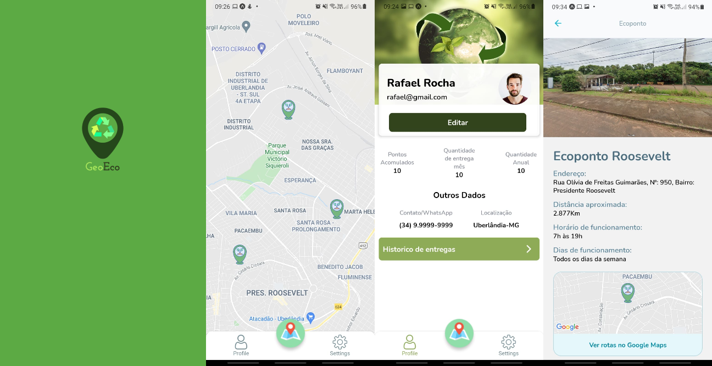

# GeoEco
GeoEco is an application that list all the recycling points in the city, to make it easier for the population to dispose of wast in the correct places.\
The App is still beign developed in React Nativo and Expo-cli, the initial goal was to be developed to be a work then in a workshop.\
Who knows, in the future, partner with cities so that the population can benefit from proper disposal.

## Application Screenshot

The screens above are: splash, ecoPontoMap, profile and ecoPontoDetails

## Start the project with Expo-cli
### We must have installed the following tools:
* Nodejs together with Npm
* Yarn
* Expo-CLI
### Installed libraries
* expo-google-fonts/nunito
* react-navigation/native
* react-navigation/bottom-tabs
* react-navigation/native-stack
* geolib
* react-content-loader
* react-native-gesture-handler
* react-native-maps
* react-native-safe-area-context
* react-native-svg

### Getting Started with Create React App
This project was bootstrapped with [Create Expo-cli App](https://github.com/expo/expo).

### Available Scripts
Install all application dependencies, the project directory:
#### `yarn install`
\
In the project directory, you can run:
#### `yarn start`

## Application Screen Features
- [x] splash screen
- [x] EcoPontoMap
- [x] Profile with static data
- [x] EcoPontoDetails

## Data application
- [x] file.json in: /src/core/database/locationEcoPontos.json

## Future implementations
 - [ ] Screen Sign In
 - [ ] Screen Sign Up
 - [ ] Screen Forgot password
 - [ ] Screen Settings
 - [ ] Screen Record the delivery of the disposal